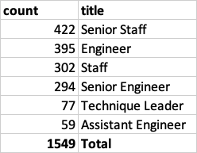
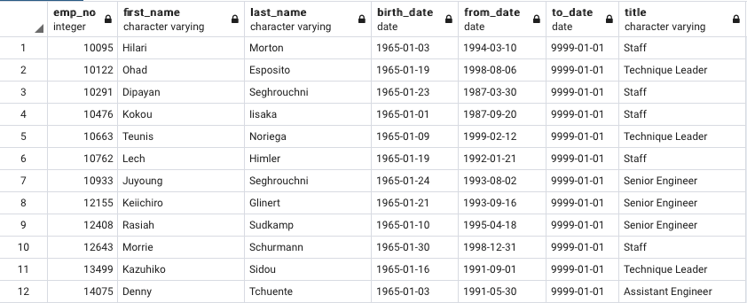

# Pewlett-Hackard-Analysis

Overview of the analysis: 
Pewlett Hackard has requested an analysis for the upcoming retiring employees with the purpose to anticipate this problem and take action. Possible solutions are mentoring programs for
some employees that meet the mentorship eligibility criteria so they can still work on the company instead of retiring. This analysis includes,
how many employees per title are retiring and additional information that may be useful for decision taking.

Results: Provide a bulleted list with four major points from the two analysis deliverables. Use images as support where needed.

## Employees per Title
In the following analysis it is important to mention some intuitive considerations: Employees will not retire at the same time, thus this will give time to the company to hire new employees. 

The image below shows the upcoming retiring titles that will be needed in order to fill those vacancies. From this image, it can be seen some useful information

* There are only 2 Managers, therefore this position needs to be filled (when the current managers retire) as fast as possible, since it is relatively easy to have non or shortage of managers because there are very few.
* In an enterprise such as Pewlett Hackard, engineers are vital, therefore the company should start the employment procedure as a priority. Starting with Senior engineers and then with engineers.
* the remaining of positions should be filled in the following order due to importance in the company. The leader is vital in order to have an organized work, thus, first is: Technique Leader,Staff, Senior Staff, Assistant Engineering.

## Employees Eligible For Mentorship Program

In the image below it can be seen , that most of staff and leaders can be eligible to a mentorship program, this is because, leaders are vital in order to keep a common objective and motivate and push other employees. Furthermore, we can see that Staff in  general terms can be useful, therefore they can create programs in order to update their knowledge and work in sales, marketing, office, social media, collecting information, etc. this is important, because these are the kind of project that make a company function and grow when non technical or scientific information is needed, whereas an enginieer always needs to be updated.

In addition, from the image above it can be suggested the following in order to make more effective the mentorship program:

* teach employees multiple skills in order to make them possible change from different areas, for instance a senior staff can be teach to be a technical leader so it can more useful in future circumnstances. or an engineer should learn the skills that a senior engineer has in order to fill that position as well. 
* mentorship programs can be done online so this could help the company 

Summary: 

How many roles will need to be filled as the "silver tsunami" begins to make an impact?

Are there enough qualified, retirement-ready employees in the departments to mentor the next generation of Pewlett Hackard employees?
